# BigQuery Enterprise Data Platform on Google Cloud

Production-oriented **Data Engineering** portfolio centered on **Google Cloud + BigQuery**, with SQL/dbt transformation, Terraform infrastructure, Python engineering utilities, Data Quality, reconciliation, security/governance, observability, and CI/CD.

> This is the **sanitized public portfolio edition**. It contains representative engineering code, synthetic/portfolio-safe datasets, infrastructure definitions, and publication-safe evidence. Raw company data, PII, credentials, confidential client metrics, private runtime artifacts, and the private working history are intentionally excluded.

## Recruiter / Hiring Manager Snapshot

**Core skills demonstrated:** `Google Cloud` · `BigQuery` · `SQL` · `dbt-bigquery` · `Terraform` · `Python` · `Data Modeling` · `Data Quality` · `Reconciliation` · `CI/CD` · `Security & Governance` · `Monitoring & Recovery`

This repository is designed to answer a practical hiring question: **“What Data Engineer responsibilities can this candidate demonstrate with inspectable evidence?”**

| Common Data Engineer expectation | Skills demonstrated | Inspectable evidence |
|---|---|---|
| Build a cloud data warehouse | GCP, BigQuery, GCS, RAW → STAGING → CORE → MART | [`terraform/phase07_bigquery.tf`](terraform/phase07_bigquery.tf), [`sql/staging/stg_orders.sql`](sql/staging/stg_orders.sql) |
| Write production-oriented SQL and data models | BigQuery SQL, dbt-bigquery, dimensional modeling, marts | [`dbt/models/marts/mart_commerce_daily.sql`](dbt/models/marts/mart_commerce_daily.sql), [`dbt/models/financial_marts/mart_reconciliation_daily.sql`](dbt/models/financial_marts/mart_reconciliation_daily.sql) |
| Build reliable incremental pipelines | Incremental processing, idempotency, late-arriving data, recovery | [`dbt/macros/phase11_incremental_window.sql`](dbt/macros/phase11_incremental_window.sql), [`sql/phase11/late_arriving_recovery.sql`](sql/phase11/late_arriving_recovery.sql), [`evidence/phase_11_incremental_runtime.json`](evidence/phase_11_incremental_runtime.json) |
| Enforce Data Quality and reconciliation | DQ rules, dbt tests, payment/control reconciliation | [`sql/audit/phase13_dq_rules.sql`](sql/audit/phase13_dq_rules.sql), [`evidence/phase_13_dq_runtime.json`](evidence/phase_13_dq_runtime.json), [`evidence/phase_14_reconciliation_runtime.json`](evidence/phase_14_reconciliation_runtime.json) |
| Optimize BigQuery workloads | Partitioning, clustering, query optimization, cost controls | [`evidence/phase_08_physical_design.json`](evidence/phase_08_physical_design.json), [`sql/phase18/wasteful_query_detection.sql`](sql/phase18/wasteful_query_detection.sql) |
| Manage infrastructure as code | Terraform / HCL, repeatable GCP/BigQuery provisioning | [`terraform/`](terraform/) |
| Secure and govern enterprise data | IAM/security patterns, governance, masking concepts, metadata/lineage | [`terraform/phase20_governance.tf`](terraform/phase20_governance.tf), [`terraform/phase21_security.tf`](terraform/phase21_security.tf), [`terraform/phase22_enterprise_security.tf`](terraform/phase22_enterprise_security.tf) |
| Monitor, diagnose, and recover | Observability, failure detection, troubleshooting, recovery evidence | [`terraform/phase16_observability.tf`](terraform/phase16_observability.tf), [`evidence/phase_16_observability_runtime.json`](evidence/phase_16_observability_runtime.json), [`evidence/phase_08_failure_recovery_runtime.json`](evidence/phase_08_failure_recovery_runtime.json) |
| Use Python for Data Engineering automation | Synthetic-data generation, privacy validation, validation utilities | [`src/generators/portfolio_safe_generator.py`](src/generators/portfolio_safe_generator.py), [`src/privacy/phase03_privacy_validator.py`](src/privacy/phase03_privacy_validator.py) |
| Apply engineering quality gates | GitHub Actions, automated validation, publication/privacy guard | [`.github/workflows/public-ci.yml`](.github/workflows/public-ci.yml), [`tools/publication_guard.py`](tools/publication_guard.py) |

## What this project demonstrates

- GCS-style landing and BigQuery **RAW → STAGING → CORE → MART** architecture
- **BigQuery SQL + dbt-bigquery** transformation and semantic modeling patterns
- Incremental MERGE, idempotency, late-arriving data, and schema evolution
- Partitioning, clustering, query optimization, and cost engineering
- Data Quality, payment reconciliation, and control-total patterns
- Monitoring, troubleshooting, failure/recovery, and operational evidence
- IAM/security, governance, masking concepts, metadata, and lineage
- Terraform infrastructure-as-code and CI/CD publication controls
- Synthetic financial-operations extension for transactions, payments, reversals, settlements, and reconciliation

## Verified engineering evidence

The canonical build was accepted through **32/32 Definition-of-Done gates**, **12/12 live runtime checks**, regression testing, and Hosted CI PASS. Evidence included here is curated for public review and contains no raw company or real banking data.

## Visual Engineering Evidence

These portfolio-safe screenshots summarize runtime, controls, recovery, security, and delivery evidence from the canonical build. They are visual entry points; the linked SQL, dbt, Terraform, JSON evidence, and CI logs remain the inspectable source evidence.

<table>
<tr><td><b>dbt-bigquery semantic runtime</b> Models, tests, semantic contracts, zero drift. 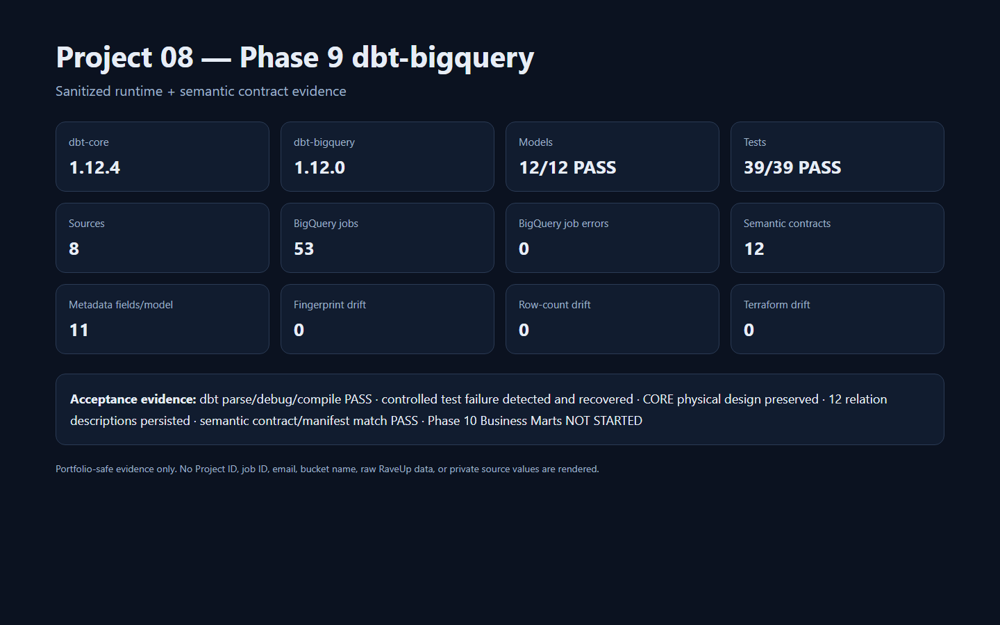</td><td><b>Incremental MERGE & late-arriving recovery</b> MERGE, idempotency, lookback window, backfill. 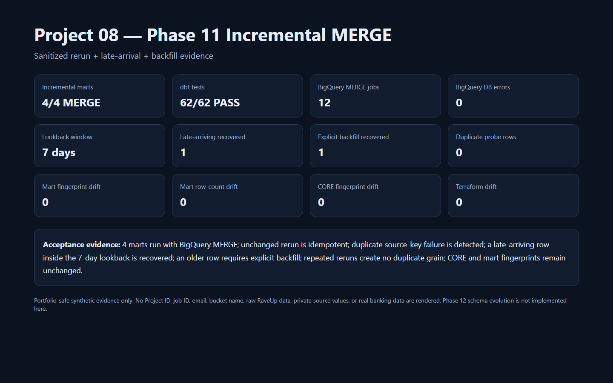</td></tr>
<tr><td><b>Payment reconciliation</b> Control totals, mismatch detection, recovery. 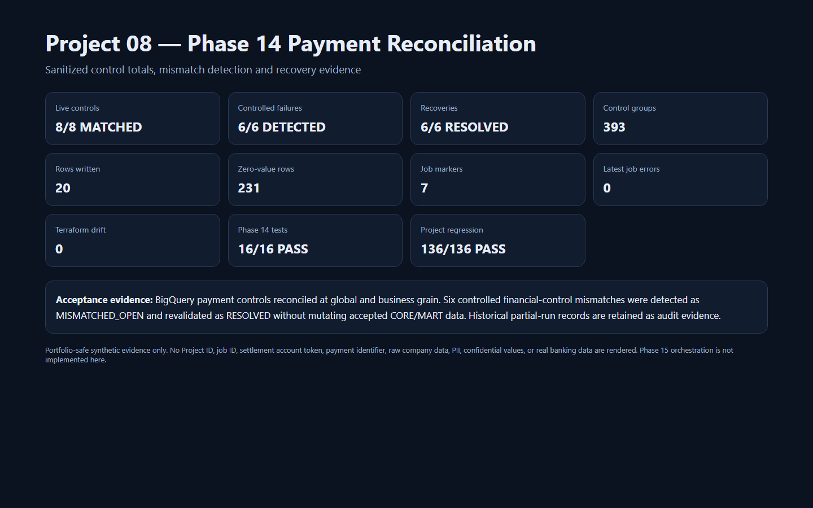</td><td><b>Operational observability</b> Monitoring, SLA breach detection, incident lifecycle. 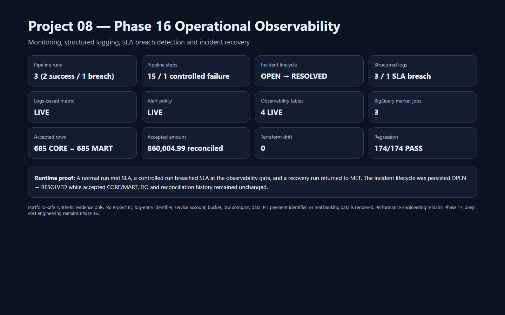</td></tr>
<tr><td><b>BigQuery performance engineering</b> Partition pruning, column pruning, query-plan evidence. 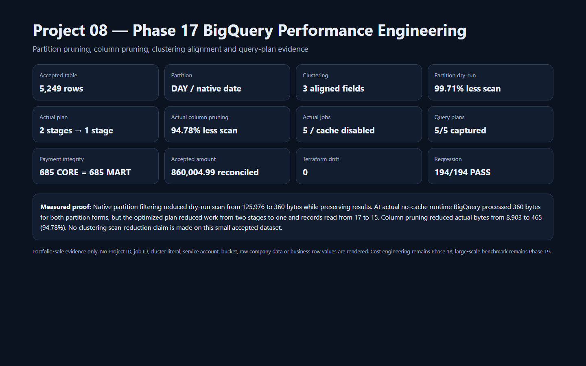</td><td><b>BigQuery cost engineering</b> Processed/billed bytes, guardrails, cost telemetry. 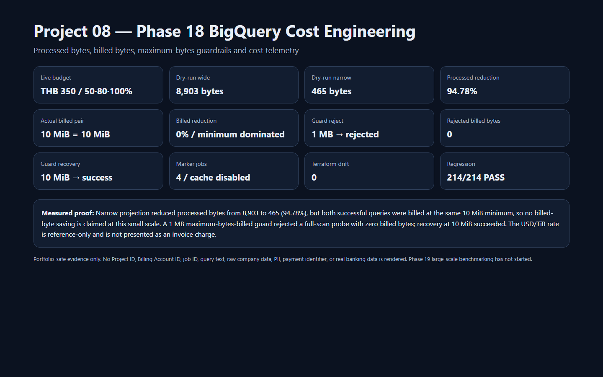</td></tr>
<tr><td><b>Governance, metadata & lineage</b> Classification, lineage paths, metadata validation. 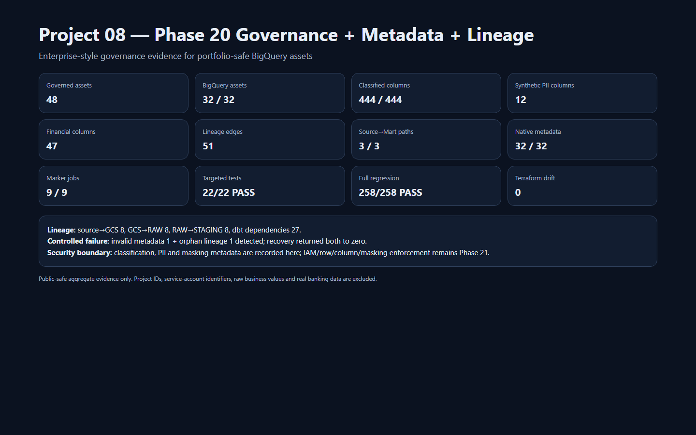</td><td><b>Enterprise security design</b> Restricted services, private-access policy, failure recovery. 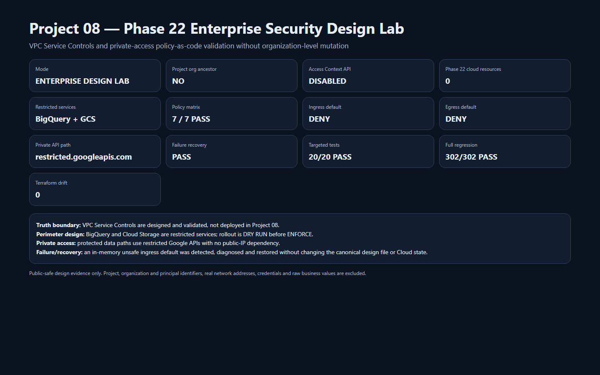</td></tr>
<tr><td><b>Failure / troubleshooting / recovery</b> Break → detect → diagnose → recover → validate. 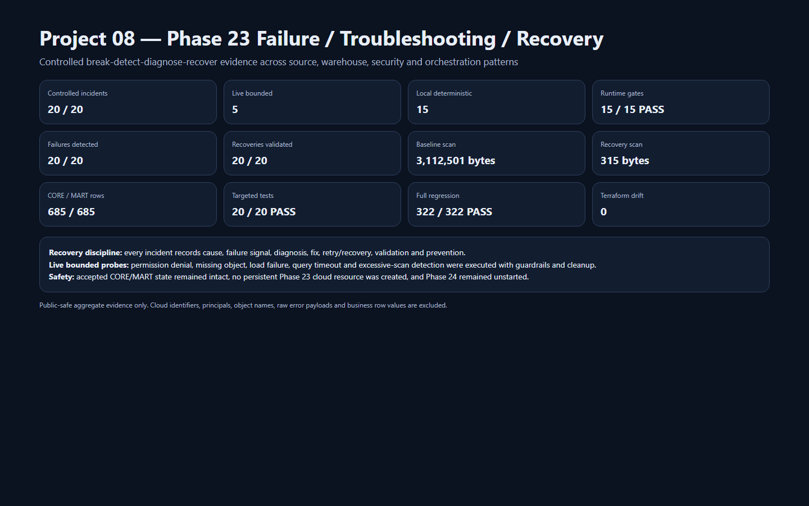</td><td><b>Synthetic financial reporting mart</b> Incremental marts, reconciliation controls, anomalies = 0. 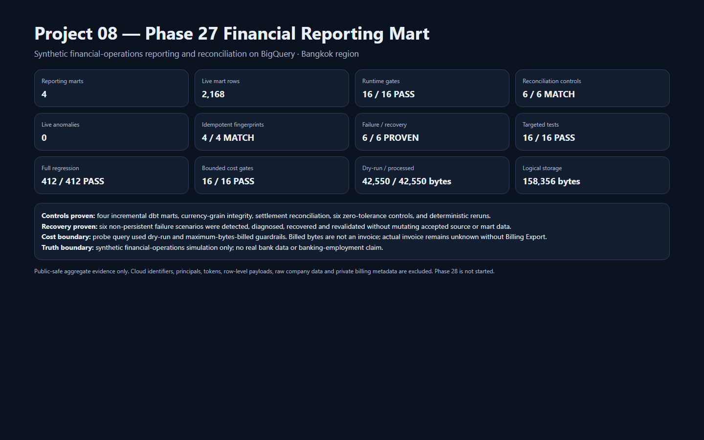</td></tr>
<tr><td><b>CI/CD quality gates</b> Hosted CI, release blocking/recovery, Terraform validation. 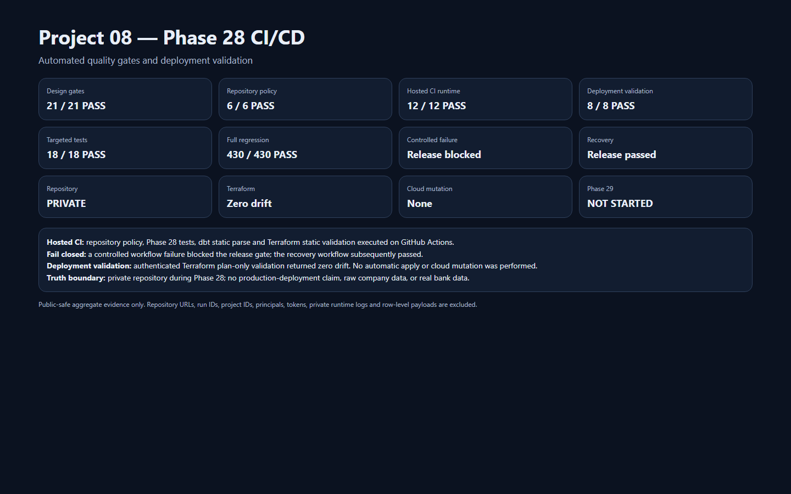</td><td><b>Final production acceptance</b> Fresh runtime, full regression, zero drift, final controls. 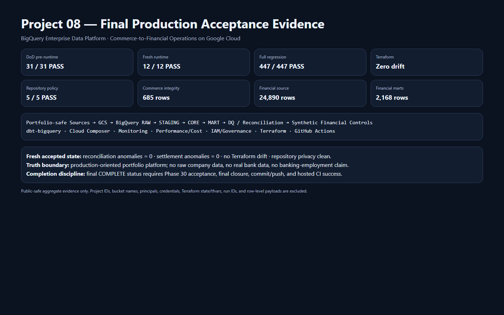</td></tr>
</table>

> **Privacy boundary:** all screenshots shown here are sanitized/public-safe summaries. They exclude project IDs, bucket names, principals, credentials, private run IDs, raw company data, PII, row-level payloads, and real banking data.
## Architecture

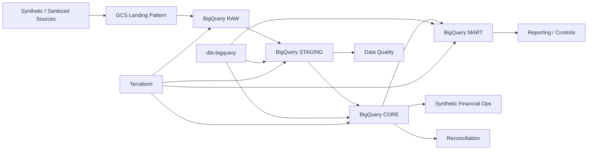

## Repository map

- `dbt/` — dbt-bigquery models and tests
- `sql/` — BigQuery/warehouse SQL patterns
- `terraform/` — BigQuery/GCP infrastructure definitions
- `src/` — synthetic generation, privacy, and validation utilities
- `data/` — synthetic / portfolio-safe datasets only
- `evidence/` — curated publication-safe verification evidence
- `tools/` — public-repository privacy guard

## Privacy and confidentiality

Business workflows may be inspired by real commerce operations, but this public repository does **not** publish raw company data, personal information, real phone/address/tax/bank values, credentials, local-only runtime evidence, or confidential client metrics. Financial/banking patterns are synthetic training extensions and are not presented as real banking experience.

## Portfolio purpose

The repository is optimized for technical review for **Data Engineer / GCP-BigQuery Data Engineer** roles. The goal is not to make one language look dominant; it is to make the actual engineering capabilities and their evidence easy to inspect.