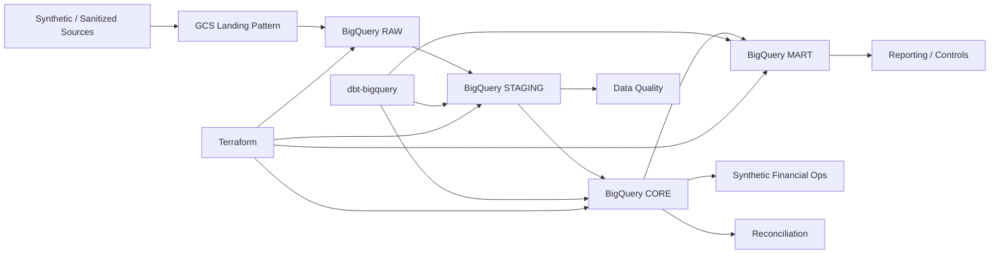

# BigQuery Enterprise Data Platform on Google Cloud

Production-oriented Data Engineering portfolio project centered on Google Cloud and BigQuery.

> This repository is the **sanitized public portfolio edition**. It contains representative engineering code, synthetic/portfolio-safe datasets, infrastructure definitions, and publication-safe evidence. Confidential source metadata, raw company data, PII, credentials, private runtime artifacts, and the private working history are intentionally excluded.

## What this project demonstrates

- GCS-style landing and BigQuery RAW → STAGING → CORE → MART architecture
- dbt-bigquery transformation and semantic modeling patterns
- Incremental MERGE, idempotency, late-arriving data, and schema evolution
- Partitioning, clustering, query optimization, and cost engineering
- Data Quality, payment reconciliation, and control-total patterns
- Monitoring, troubleshooting, failure/recovery, and operational evidence
- IAM/security, governance, masking concepts, metadata, and lineage
- Terraform infrastructure-as-code and CI/CD publication controls
- Synthetic financial-operations extension for transactions, payments, reversals, settlements, and reconciliation

## Verified engineering evidence

The canonical build was accepted through **32/32 Definition-of-Done gates**, **12/12 live runtime checks**, **464 public-safe regression tests** with **1 intentional skip**, and Hosted CI PASS. Evidence included here is curated for public review and contains no raw company or real banking data.

## Architecture

## Repository map

- `dbt/` — dbt-bigquery models and tests
- `sql/` — warehouse SQL patterns
- `terraform/` — BigQuery/GCP infrastructure definitions
- `src/` — synthetic generation, privacy, and validation utilities
- `data/` — synthetic / portfolio-safe datasets only
- `evidence/` — curated publication-safe verification evidence
- `tools/` — public-repository privacy guard

## Privacy and confidentiality

Business workflows may be inspired by real commerce operations, but this public repository does **not** publish raw company data, personal information, real phone/address/tax/bank values, credentials, local-only runtime evidence, or confidential client metrics. Financial/banking patterns are synthetic training extensions and are not presented as real banking experience.

## Portfolio purpose

The repository is designed for technical review during Data Engineer interviews: architecture, SQL/dbt modeling, reliability controls, BigQuery engineering, security/governance, Terraform, CI/CD, and evidence-based validation can be inspected without exposing confidential operational data.
